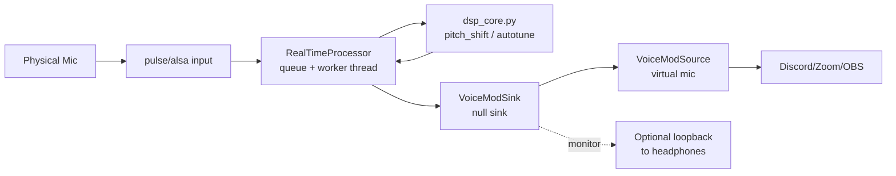
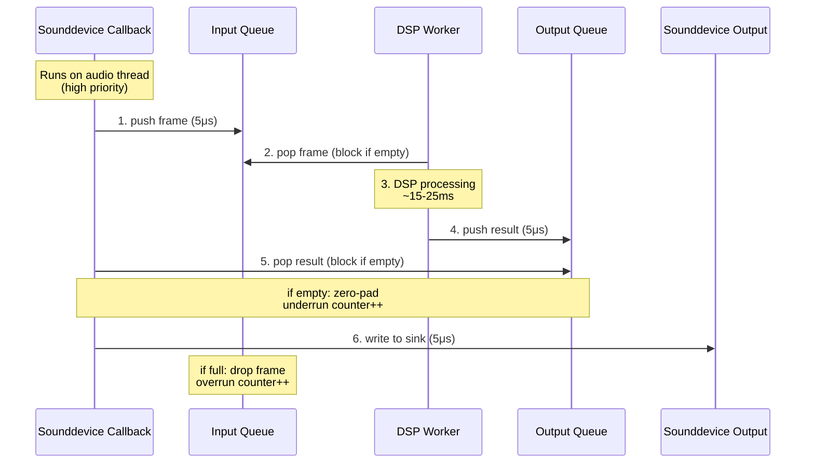

# VoiceModL Architecture

## High-level flow

## Components

- **PulseAudio/PipeWire routing**: `scripts/create_virtual_devices.sh` sets up `VoiceModSink` (null sink) and `VoiceModSource` (virtual mic attached to the sink monitor). Apps select `VoiceModSource` as the mic.
- **Audio I/O** (`src/audio_io.py`): uses `sounddevice` to read from selected input device and write to output device. `RealTimeProcessor` keeps the callback light by pushing frames through queues to a worker thread.
- **DSP** (`src/dsp_core.py`): per-frame processing
  - `pitch_shift`: librosa pitch shift (light resampler)
  - `simple_autotune`: f0 via pyin → snap to scale → pitch shift
  - Clamps output to [-1,1]
- **CLI** (`src/main.py`): chooses devices, preset, blocksize, dry/wet mix; starts the RT processor.
- **Presets** (`src/presets.py`, `configs/presets.json`): named effect settings (pitch offsets, autotune key/scale).
- **Helper scripts**: `run_voicemod_demo.sh` bootstraps the run with env overrides.

## Threading model

## Routing specifics (PulseAudio/PipeWire)

1. `VoiceModSink` is a null sink that receives processed audio.
2. `VoiceModSource` is a virtual source whose master is `VoiceModSink.monitor`; apps see it as a microphone.
3. Optionally load `module-loopback` to monitor `VoiceModSource.monitor` in headphones for self-monitoring.
4. Use `pavucontrol` to move the Python playback stream to `VoiceModSink` if needed.

## Latency knobs

- `--blocksize`: larger = safer/fewer XRUNs, higher latency (start 2048–4096).
- `--samplerate`: 48 kHz recommended to match Pulse defaults.
- DSP cost: autotune heavier than fixed pitch shift; use `--preset female/male` for lighter load.

## Dry/Wet mixing

- CLI flag `--drywet` blends processed audio with original mono frame (0=dry, 1=wet). Implemented in `src/main.py` before channel duplication.

## Stats and logging

- `RealTimeProcessor.stats`: `dropped_in` (input queue full) and `underrun_out` (no processed frame ready). Printed on Ctrl+C exit.
- Warnings suppressed when pyin sees silence (returns NaN f0).

